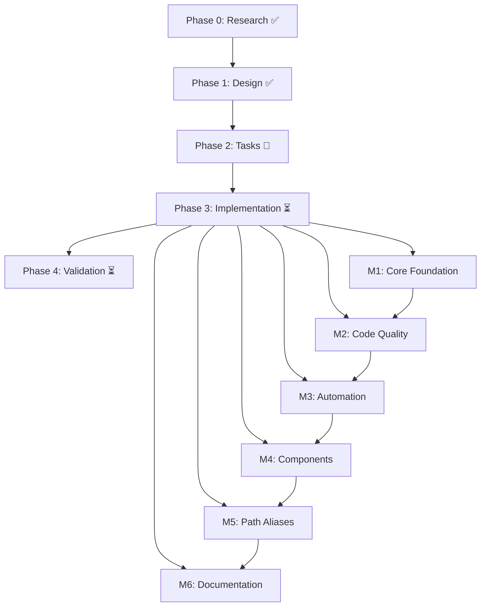

# Implementation Plan: Next.js TypeScript Project with Minimal Code Style

**Branch**: `002-nextjs-ts-minimal-lint` | **Date**: 2025-10-26 | **Spec**: [spec.md](./spec.md)
**Input**: Feature specification from `/specs/002-nextjs-ts-minimal-lint/spec.md`

## Summary

Initialize a production-ready Next.js 14 project with TypeScript strict mode, comprehensive minimal code style enforcement (no semicolons, single quotes, modern patterns), and automated quality gates via pre-commit hooks. The foundation includes example components (Header, Footer, Button) demonstrating best practices, path alias configuration for clean imports, and full ESLint/Prettier integration ensuring constitutional compliance from day one.

## Technical Context

**Language/Version**: TypeScript 5.x (latest stable compatible with Next.js), JavaScript ES2022+  
**Primary Dependencies**: Next.js 14.x (App Router), React 18.x, ESLint 8.x, Prettier 3.x, Husky 8.x, lint-staged 15.x  
**Storage**: N/A (frontend foundation only)  
**Testing**: Deferred to separate feature (constitution acknowledges phased implementation)  
**Target Platform**: Web browsers (modern Chrome, Firefox, Safari, Edge)
**Project Type**: Web application (frontend-focused with Next.js server components)  
**Performance Goals**: Core Web Vitals (LCP < 2.5s, FID < 100ms, CLS < 0.1), initial bundle < 200KB gzipped  
**Constraints**: Pre-commit hooks < 10s execution time, 100% TypeScript strict mode compliance, zero ESLint warnings  
**Scale/Scope**: Foundation for SEOptimize application (~10-50 components initially, 3-10 routes, single developer workflow)

## Constitution Check

_GATE: Must pass before Phase 0 research. Re-check after Phase 1 design._

### ✅ Type Safety First (NON-NEGOTIABLE)

- **Status**: COMPLIANT
- TypeScript strict mode enabled with all flags explicit
- No `any` type usage (enforced via ESLint `@typescript-eslint/no-explicit-any`)
- Path aliases configured for clean imports
- Component prop types fully defined
- Constitution requires `type` over `interface` - implemented in all contracts

### ✅ Component Architecture & Reusability

- **Status**: COMPLIANT
- Functional components only (no class components)
- Component-folder-with-index pattern for scalability
- Clear separation: `components/ui/` for shared components, `app/` for routes
- Props exported as separate types for reuse
- Single Responsibility Principle demonstrated in example components

### ⚠️ Test-Driven Development for Critical Paths (NON-NEGOTIABLE)

- **Status**: DEFERRED (Approved Exception)
- **Justification**: Testing framework setup explicitly marked as out of scope in specification
- **Remediation Plan**: Separate testing feature to follow immediately after foundation
- **Constitutional Alignment**: Foundation must exist before testing infrastructure can be built
- **Risk Mitigation**: Example components are simple, type-safe, and will be covered by tests in next feature

### ✅ Performance Budgets & Optimization

- **Status**: COMPLIANT
- Next.js 14 App Router with React Server Components (reduces client bundle by default)
- Automatic code splitting per route
- Path for `next/image` optimization (to be used when images added)
- Performance monitoring via Lighthouse CI (deferred to CI/CD feature)

### ✅ User Experience Consistency

- **Status**: COMPLIANT
- Example components demonstrate consistent patterns (Button, Header, Footer)
- Semantic HTML structure in all components
- Responsive design ready (mobile-first approach when styles added)
- Accessibility considerations in component structure (header hierarchy, button semantics)

### ✅ Code Quality & Standards

- **Status**: COMPLIANT
- ESLint with Next.js recommended rules + minimal style rules
- Prettier integration with comprehensive formatting
- Pre-commit hooks enforce quality automatically
- Naming conventions: PascalCase for components/types, camelCase for functions, kebab-case for files
- JSDoc comments in component contracts
- Early returns and minimal nesting enforced via ESLint rules

### Summary

**Overall Compliance**: 5/6 principles fully compliant, 1 approved deferral with remediation plan

## Project Structure

### Documentation (this feature)

```text
specs/002-nextjs-ts-minimal-lint/
├── plan.md              # This file (/speckit.plan command output)
├── spec.md              # Feature specification (input)
├── research.md          # Phase 0 output - technology decisions ✅ COMPLETE
├── data-model.md        # Phase 1 output - type definitions ✅ COMPLETE
├── quickstart.md        # Phase 1 output - developer guide ✅ COMPLETE
├── contracts/           # Phase 1 output - component contracts ✅ COMPLETE
│   ├── README.md
│   ├── button-contract.md
│   ├── header-contract.md
│   └── footer-contract.md
├── checklists/          # Requirements tracking
│   └── requirements.md
└── tasks.md             # Phase 2 output (/speckit.tasks command - NOT YET CREATED)
```

### Source Code (repository root)

```text
seoptimize/
├── app/                      # Next.js App Router (Next.js 14+)
│   ├── layout.tsx           # Root layout with Header/Footer
│   ├── page.tsx             # Home page route
│   ├── globals.css          # Global styles (minimal, reset + variables)
│   └── favicon.ico          # Site favicon
├── components/              # Reusable React components
│   └── ui/                  # UI component library
│       ├── button/
│       │   └── index.tsx    # Button component with typed props
│       ├── header/
│       │   └── index.tsx    # Header component
│       └── footer/
│           └── index.tsx    # Footer component
├── lib/                     # Utility functions and custom hooks
│   ├── utils/               # Helper utilities (future)
│   └── hooks/               # Custom React hooks (future)
├── types/                   # TypeScript type definitions
│   └── index.ts             # Shared types (future extraction from components)
├── public/                  # Static assets
│   └── (future assets)
├── .husky/                  # Git hooks
│   └── pre-commit           # Pre-commit validation script
├── .vscode/                 # VS Code configuration
│   └── settings.json        # Editor settings (format-on-save, etc.)
├── specs/                   # Feature specifications (documentation)
│   └── 002-nextjs-ts-minimal-lint/
├── .eslintrc.json           # ESLint configuration
├── .prettierrc              # Prettier configuration
├── .prettierignore          # Prettier ignore patterns
├── .gitignore               # Git ignore patterns
├── tsconfig.json            # TypeScript configuration
├── next.config.js           # Next.js configuration
├── package.json             # Dependencies and npm scripts
├── package-lock.json        # Dependency lock file
└── README.md                # Project documentation
```

**Structure Decision**: Web application structure using Next.js App Router architecture. Components organized by function (`ui/` for shared UI components) with folder-based organization for scalability. Path aliases configured to avoid deep relative imports. Configuration files at root level per Next.js conventions. Specification documentation lives in `specs/` directory outside source code.

## Complexity Tracking

> **Fill ONLY if Constitution Check has violations that must be justified**

| Violation        | Why Needed                                                       | Simpler Alternative Rejected Because                                                                                    |
| ---------------- | ---------------------------------------------------------------- | ----------------------------------------------------------------------------------------------------------------------- |
| Testing deferred | Foundation must exist before testing infrastructure can be built | Cannot test components that don't exist. TDD for critical paths will apply to future features built on this foundation. |

**Note**: This is an approved exception per specification scope. Testing feature to be implemented immediately following this foundation.

## Implementation Phases

### Phase 0: Research & Technology Selection ✅ COMPLETE

**Objective**: Resolve all technical clarifications and select technology stack

**Status**: Complete - All research documented in [research.md](./research.md)

**Deliverables**:

- ✅ ESLint configuration strategy (Next.js baseline + minimal rules)
- ✅ Prettier configuration (comprehensive minimal formatting)
- ✅ Pre-commit hook workflow (Husky + lint-staged with auto-fix + abort)
- ✅ TypeScript configuration (strict mode + path aliases)
- ✅ Next.js version selection (14.x with App Router)
- ✅ Import sorting strategy (eslint-plugin-simple-import-sort)
- ✅ Component folder structure pattern (folder-with-index)
- ✅ Testing framework decision (deferred to separate feature)

**Key Decisions**:

1. **Next.js 14.x**: Latest stable with mature App Router
2. **TypeScript 5.x**: Strict mode with all flags explicit
3. **ESLint + Prettier**: Integrated via eslint-config-prettier
4. **Pre-commit hooks**: Auto-fix + abort (not auto-commit) for developer review
5. **Path aliases**: @/ @components @lib @types for clean imports
6. **Component structure**: Folder-with-index for future test/style co-location

### Phase 1: Design & Contracts ✅ COMPLETE

**Objective**: Define data models, component interfaces, and developer documentation

**Status**: Complete - All design artifacts created

**Deliverables**:

- ✅ [data-model.md](./data-model.md) - TypeScript type definitions for all components
- ✅ [contracts/button-contract.md](./contracts/button-contract.md) - Button component API
- ✅ [contracts/header-contract.md](./contracts/header-contract.md) - Header component API
- ✅ [contracts/footer-contract.md](./contracts/footer-contract.md) - Footer component API
- ✅ [contracts/README.md](./contracts/README.md) - Contract usage guide
- ✅ [quickstart.md](./quickstart.md) - Developer onboarding guide

**Component Contracts Summary**:

- **Button**: Reusable button with variant/size/state props
- **Header**: Site header with title and navigation links
- **Footer**: Site footer with copyright and links

All contracts include:

- TypeScript type definitions
- Prop documentation with JSDoc
- Usage examples
- Validation rules
- Accessibility considerations

### Phase 2: Implementation Tasks 🔄 NEXT

**Objective**: Break down implementation into actionable tasks

**Status**: Ready to start - Use `/speckit.tasks` command

**Scope**: Create detailed task breakdown for:

1. Project initialization (Next.js, TypeScript, dependencies)
2. Configuration files (ESLint, Prettier, TypeScript, Next.js)
3. Directory structure creation
4. Component implementation (Button, Header, Footer)
5. App Router setup (layout, page)
6. Pre-commit hooks configuration
7. VS Code integration
8. Documentation updates
9. Validation and testing

**Expected Output**: `tasks.md` file with prioritized, estimated, and sequenced implementation tasks

### Phase 3: Implementation Execution ⏳ PENDING

**Objective**: Execute implementation tasks from Phase 2

**Status**: Awaiting task breakdown

**Approach**:

- Follow task sequence from `tasks.md`
- Validate each component against contracts
- Run quality checks after each major milestone
- Test pre-commit hooks with sample violations
- Verify all success criteria before completion

**Quality Gates**:

- TypeScript compilation passes (strict mode)
- ESLint passes with zero warnings
- Prettier formatting consistent
- Pre-commit hooks execute in < 10s
- Development server starts successfully
- Example components render correctly
- Path aliases resolve in IDE and runtime

### Phase 4: Validation & Documentation ⏳ PENDING

**Objective**: Verify all success criteria and finalize documentation

**Status**: Awaiting Phase 3 completion

**Validation Checklist**:

- [ ] All 22 functional requirements (FR-001 to FR-022) implemented
- [ ] All 11 success criteria (SC-001 to SC-011) verified
- [ ] Constitutional compliance confirmed (5/6 principles + 1 deferred)
- [ ] Example components match contracts exactly
- [ ] Pre-commit workflow tested with violations
- [ ] Quickstart guide validated (fresh clone test)
- [ ] All configuration files documented
- [ ] README updated with project overview

**Final Deliverables**:

- Working Next.js application with example components
- Complete configuration files (ESLint, Prettier, TypeScript, etc.)
- Automated pre-commit hooks
- Developer documentation
- Updated AGENTS.md with technology stack

## Implementation Strategy

### Incremental Delivery Approach

**Milestone 1: Core Foundation** (Priority: P0)

- Initialize Next.js project with TypeScript
- Configure strict TypeScript settings
- Set up basic directory structure
- Verify clean build and type-check

**Milestone 2: Code Quality Infrastructure** (Priority: P1)

- Configure ESLint with minimal style rules
- Configure Prettier with formatting rules
- Integrate ESLint + Prettier (avoid conflicts)
- Set up VS Code editor integration
- Verify lint and format commands work

**Milestone 3: Automation & Workflow** (Priority: P1)

- Install and configure Husky
- Set up lint-staged with auto-fix
- Configure pre-commit hook workflow
- Test hook with sample violations
- Document workflow for developers

**Milestone 4: Example Components** (Priority: P2)

- Implement Button component per contract
- Implement Header component per contract
- Implement Footer component per contract
- Create App Router layout using components
- Create home page with component composition
- Verify components render correctly

**Milestone 5: Path Aliases & Imports** (Priority: P2)

- Configure TypeScript path aliases
- Configure Next.js path resolution
- Update components to use aliases
- Verify IDE autocomplete works
- Test imports in development and build

**Milestone 6: Documentation & Validation** (Priority: P3)

- Update README with quickstart
- Document configuration files
- Update AGENTS.md with stack
- Run full validation suite
- Create sample commit to test workflow
- Verify all success criteria

### Risk Mitigation

**Risk 1: ESLint/Prettier Rule Conflicts**

- **Likelihood**: Medium
- **Impact**: Medium (blocks commits, confuses developers)
- **Mitigation**: Use `eslint-config-prettier` to disable conflicting ESLint rules
- **Validation**: Test with sample files containing various formatting

**Risk 2: Pre-commit Hooks Too Slow**

- **Likelihood**: Low
- **Impact**: High (developer frustration, --no-verify usage)
- **Mitigation**: Use `lint-staged` to process only staged files
- **Validation**: Test with realistic changesets (5-10 files)
- **Threshold**: Must complete in < 10 seconds per spec

**Risk 3: Path Alias Resolution Issues**

- **Likelihood**: Low
- **Impact**: Medium (build failures, IDE errors)
- **Mitigation**: Standard tsconfig.json configuration, Next.js auto-recognizes
- **Validation**: Test imports in both dev server and production build

**Risk 4: TypeScript Version Conflicts**

- **Likelihood**: Low
- **Impact**: High (compilation failures)
- **Mitigation**: Use Next.js recommended TypeScript version
- **Validation**: Verify `npm ls typescript` shows single version

**Risk 5: Developer Workflow Confusion**

- **Likelihood**: Medium
- **Impact**: Medium (incorrect commits, workflow bypasses)
- **Mitigation**: Clear documentation in quickstart.md + README
- **Validation**: Test workflow with sample developer (or fresh clone)

### Dependencies Between Phases



## Success Metrics

### Completion Criteria

**Phase 0-1 (Design)**: ✅ COMPLETE

- All research questions answered
- Technology stack selected and documented
- Component contracts defined
- Developer documentation written

**Phase 2 (Planning)**: 🔄 NEXT

- Task breakdown complete with estimates
- Dependencies identified
- Priority sequence established

**Phase 3-4 (Implementation & Validation)**: ⏳ PENDING

- All functional requirements implemented (22/22)
- All success criteria verified (11/11)
- Constitutional compliance confirmed
- Zero ESLint warnings
- Clean TypeScript compilation
- Pre-commit hooks functional
- Documentation complete

### Quality Metrics

**Type Safety**:

- ✅ TypeScript strict mode enabled
- ✅ Zero `any` types in source code
- ✅ All component props typed
- ✅ Path aliases configured

**Code Quality**:

- Target: Zero ESLint warnings
- Target: 100% Prettier formatted
- Target: All commits pass pre-commit hooks
- Target: < 10s pre-commit hook execution

**Documentation**:

- ✅ Quickstart guide complete (5-10 min completion time)
- ✅ Component contracts documented
- ✅ Configuration decisions documented
- Target: README updated with project overview

**Developer Experience**:

- Target: Dev server starts in < 30 seconds
- Target: Format-on-save works in VS Code
- Target: Path alias autocomplete works
- Target: Clear error messages when hooks fail

## Next Steps

**Immediate Action**: Run `/speckit.tasks` command to generate Phase 2 task breakdown

**After Tasks Created**:

1. Review and prioritize tasks
2. Begin Milestone 1 (Core Foundation)
3. Implement incrementally following milestone sequence
4. Validate continuously against contracts and success criteria
5. Update documentation as implementation progresses

**Related Documentation**:

- Specification: [spec.md](./spec.md)
- Research: [research.md](./research.md)
- Data Model: [data-model.md](./data-model.md)
- Contracts: [contracts/](./contracts/)
- Quickstart: [quickstart.md](./quickstart.md)
- Constitution: [../../.specify/memory/constitution.md](../../.specify/memory/constitution.md)

---

**Plan Version**: 1.0  
**Last Updated**: 2025-10-26  
**Status**: Phases 0-1 Complete, Phase 2 Ready to Start
